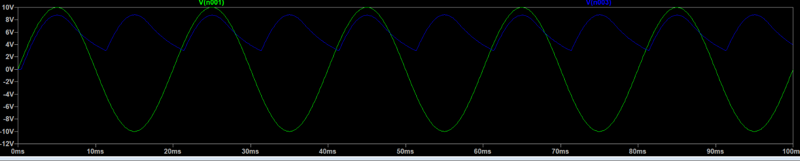
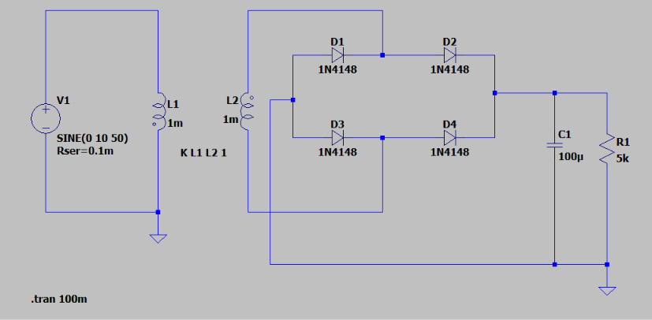
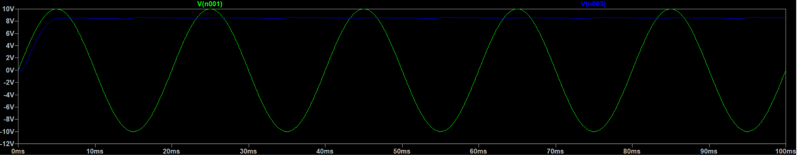

# Full-Wave Bridge Rectifier with Capacitor Filter using LTspice

## Overview

This project demonstrates the design and simulation of a Full-Wave Bridge Rectifier with a Capacitor Filter in LTspice. The circuit converts an AC input voltage into a DC output voltage using four diodes connected in a bridge configuration. A filter capacitor is used across the load resistor to smooth the rectified output and reduce ripple voltage. Two different capacitor values were analyzed to study their effect on output voltage ripple and DC smoothing.

---

## Components Used

- AC Voltage Source: SINE(0 10 50)
- Transformer (L1 = 1mH, L2 = 1mH)
- Coupling Coefficient: K L1 L2 1
- Diodes: 1N4148 (D1, D2, D3, D4)
- Load Resistor: 5 kΩ
- Capacitor:
  - Case 1: 1 µF
  - Case 2: 100 µF
- Simulation Command:
  ```
  .tran 100m
  ```

---

## Working Principle

The AC input voltage is first applied to the transformer, which provides electrical isolation and transfers the AC signal to the secondary winding. The four diodes form a bridge rectifier that converts both positive and negative half-cycles of the AC waveform into a pulsating DC waveform. During each cycle, two diodes conduct while the other two remain reverse-biased, ensuring that current always flows through the load in the same direction.

A capacitor is connected across the load resistor to smooth the rectified voltage. The capacitor charges when the rectified voltage reaches its peak value and discharges slowly through the load when the input voltage decreases. This charging and discharging action reduces fluctuations in the output voltage and produces a more stable DC output.

---

# Case 1: Capacitor = 1 µF

## Circuit Diagram


## Output Waveform



## Observation

With a 1 µF capacitor, the output voltage contains noticeable ripple. The capacitor stores only a small amount of charge and discharges relatively quickly through the load resistor between successive peaks of the rectified waveform. As a result, the output voltage rises and falls periodically, producing a DC voltage with significant ripple.

---

# Case 2: Capacitor = 100 µF

## Circuit Diagram



## Output Waveform



## Observation

With a 100 µF capacitor, the output voltage becomes much smoother and nearly constant. The larger capacitor stores more energy and discharges slowly through the load resistor, maintaining the output voltage between consecutive peaks of the rectified waveform. This significantly reduces ripple voltage and results in a cleaner DC output.

---

## Results Comparison

| Parameter | Case 1 (1 µF) | Case 2 (100 µF) |
|------------|---------------|------------------|
| Ripple Voltage | High | Very Low |
| Output Smoothness | Moderate | Excellent |
| DC Stability | Lower | Higher |
| Capacitor Energy Storage | Low | High |

---

## Conclusion

The Full-Wave Bridge Rectifier successfully converts AC voltage into DC voltage. The simulation demonstrates the important role of the filter capacitor in reducing ripple voltage. Increasing the capacitor value from 1 µF to 100 µF significantly improves the quality of the DC output by producing a smoother and more stable voltage. This principle is widely used in power supplies, battery chargers, adapters, and electronic systems that require DC power from an AC source.

---

## Applications

- AC to DC Power Supplies
- Mobile Phone Chargers
- Battery Charging Circuits
- DC Power Adapters
- Embedded System Power Supplies
- Consumer Electronics
- Industrial Power Supplies

---

## Software Used

- LTspice XVII / LTspice 26
